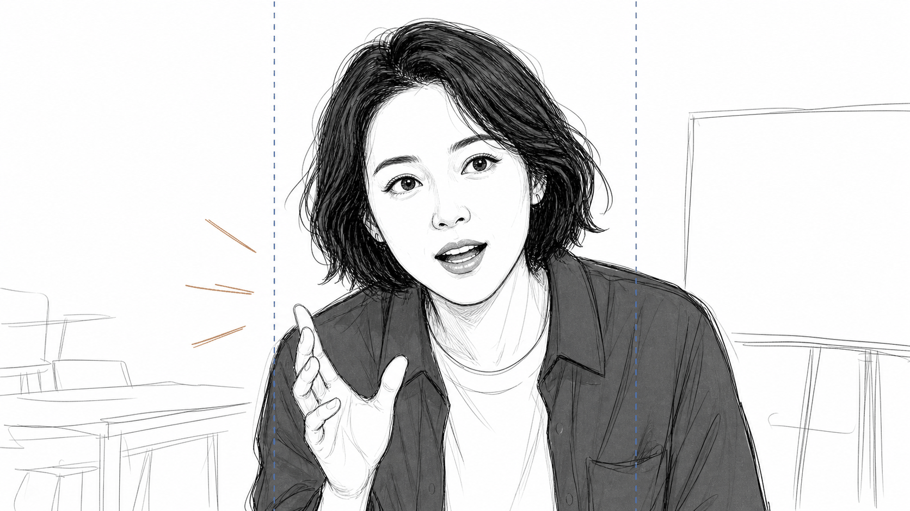
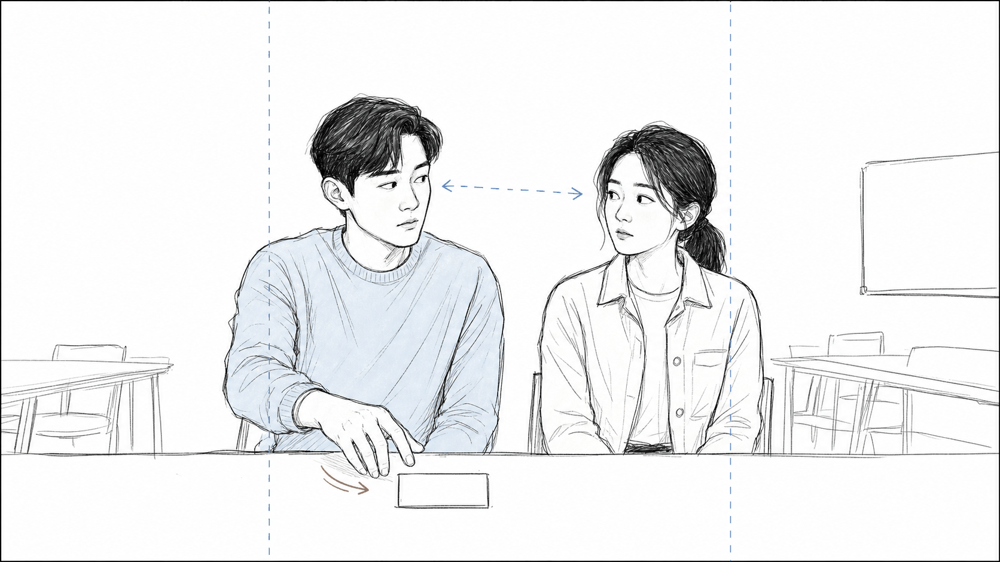
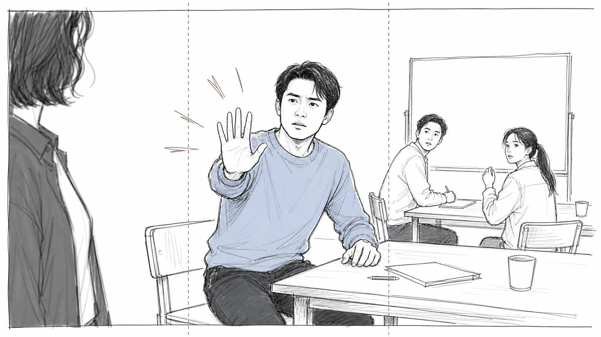
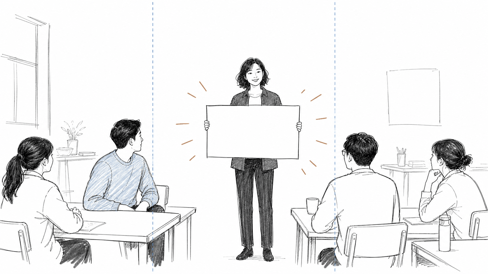

# 홍보 영상 스토리보드 예시

단편 서사형 촬영 콘티

## 화면 구성 가이드

- 검은 외곽선: 가로형으로 촬영되는 전체 16:9 화면입니다.
- 파란 세로 점선 사이: 세로형으로 잘라도 남는 중앙 9:16 안전 영역입니다.
- 점선 바깥 좌우 영역: 가로형에서는 보이지만 세로형 변환 시 잘릴 수 있습니다.
- 주요 얼굴과 손동작, 핵심 소품은 파란 점선 사이에 배치합니다.

## 컷 1 - 00:00-00:03 - 3초

| 설명 | 행동 메모 |
| --- | --- |
| 장면명 | 도입 대사 |
| 화면 | 인물 근접 화면 |
| 동작 | 진행자가 모임을 향해 상체를 살짝 기울이며 첫 대사를 건넨다. |
| 세로 전환 | 진행자의 눈과 입이 중앙 세로 영역 안에 들어오도록 한다. |
| 대사 | 진행자: 이제 시작할 준비가 됐습니다. |
| 효과음 | 낮게 긴장감을 주는 음악이 시작된다. |

## 컷 2 - 00:03-00:06 - 3초

| 설명 | 행동 메모 |
| --- | --- |
| 장면명 | 눈빛 교환 |
| 화면 | 두 사람 반응 화면 |
| 동작 | 참가자 가와 참가자 나가 말없이 서로 눈치를 본다. 참가자 가는 빈 소품 쪽으로 손을 뻗는다. |
| 세로 전환 | 두 사람의 얼굴과 뻗은 손이 중앙 영역 안에 들어오도록 한다. |
| 대사 | 대사 없음. |
| 효과음 | 잔잔한 실내 배경음이 이어진다. |

## 컷 3 - 00:06-00:09 - 3초

| 설명 | 행동 메모 |
| --- | --- |
| 장면명 | 움직임 제지 |
| 화면 | 중간 거리 화면 |
| 동작 | 참가자 가가 자리에서 반쯤 일어나 한쪽 손바닥을 내밀며 모두의 움직임을 멈춘다. |
| 세로 전환 | 참가자 가의 얼굴과 내민 손을 세로 자르기 안내선 사이에 둔다. |
| 대사 | 참가자 가: 잠깐만요. |
| 효과음 | 음악이 갑자기 끊긴다. |

## 컷 4 - 00:09-00:12 - 3초

| 설명 | 행동 메모 |
| --- | --- |
| 장면명 | 안내판 공개 |
| 화면 | 넓은 화면 |
| 동작 | 진행자가 빈 안내판을 들어 올리자 참가자들이 움직임을 멈추고 안내판을 바라본다. |
| 세로 전환 | 진행자와 안내판, 참가자 가와 주요 반응 인물을 화면 중앙 가까이에 둔다. |
| 대사 | 대사 없음. |
| 효과음 | 짧은 강조음 뒤에 정적이 흐른다. |
